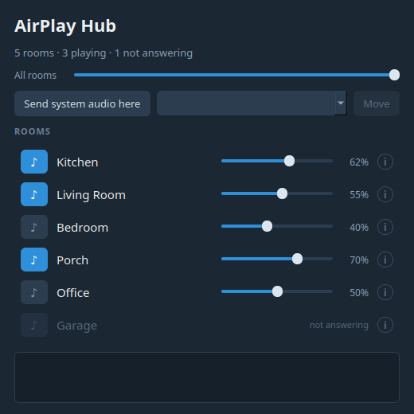

# AirPlay Hub

**The same music in every room, from your Linux machine.** Spotify in the
kitchen, PlexAmp on the porch and radio in the bedroom — all at once, each with
its own volume.

Airfoil exists for macOS and Windows. Nothing like it existed for Linux. This
is that app.



## Why it exists

I have a 2009 Mac Mini that is always on. It does exactly one thing: stream
music from PlexAmp to the speakers around the house, through Airfoil.

Apple dropped support for it long ago. It was kept alive with OpenCore Legacy
Patcher, but Ventura is no longer supported, and Sequoia would only make a
seventeen-year-old machine slower still. Buying a new Mac to keep doing one
single thing felt wrong.

CachyOS turned out to run beautifully on a MacMini3,1. That left one problem:
there was no Airfoil for Linux. So I built it.

**Thanks to [Rogue Amoeba](https://rogueamoeba.com/airfoil/) for Airfoil**,
which gave both the idea and the model for the interface.

## What you can stream to

Everything that speaks AirPlay, in one list:

- **HomePod, Apple TV and Macs** — including the newer ones that require FairPlay
- **Volumio and shairport-sync** on a Raspberry Pi
- **AirPort Express**, if you still have one running

You never have to know which kind a room is. The app works out how to reach
each device, and every room looks the same regardless.

## Getting started

You need an Arch-based system running PipeWire — CachyOS, EndeavourOS, Manjaro
or Arch itself.

```bash
git clone https://github.com/napthemax/airplay-hub.git
cd airplay-hub
./install.sh
```

The script tells you what is missing and offers to install it. Then it sets
everything up: speaker discovery, the audio path to AirPlay 2 devices, a menu
entry, and the web interface for your phone.

When it finishes, look for **AirPlay Hub** in your application menu. No
terminal needed after that.

To undo it: `./install.sh --uninstall`

## Using it

**Send the audio here.** Press *Send system audio here* and everything playing
on the machine goes to the hub. To move a single app instead, pick it from the
list and press *Move*.

**Turn rooms on.** Press the speaker button to the left of a room's name. It
lights up blue while that room is playing. Volume is per room, and the slider
at the top controls all of them at once.

**From your phone.** Open `http://your-machines-ip:8730` — the installer prints
the address. Same rooms, same buttons. Add it to your home screen and it
behaves like an app.

If the phone times out, a firewall is dropping it. The installer offers to open
the port; to do it by hand:

```bash
sudo ufw allow from 192.168.1.0/24 to any port 8730 proto tcp
```

Use your own subnet — `./diagnose.sh` prints the exact command.

The web interface only accepts connections from your own network. There is no
login, and it should never be port-forwarded.

## If the rooms are out of sync

**This only applies if you own both AirPlay 1 and AirPlay 2 speakers.** With
only one kind, every room takes the same path, shares the same buffer and stays
in step by itself. The app detects that and keeps the timing controls hidden.

A mix can drift, because the two audio paths buffer differently. You hear it as
an echo between rooms. The window then shows **Hold back the faster path**
under the room list (delay AirPlay 1 at the hub) and **Match timing…** next to
the rooms (leftover per-room trim). The phone page gets both. That is the
place to start — not a PipeWire latency setting.

**Delay rooms that are ahead.** Open **i** on an AirPlay 2 room that you hear
first and drag the slider toward **later**, then release. OwnTone only applies
the offset the next time it builds a session, so the change lands after a short
gap in that room. The slider is remembered by room name if OwnTone is restarted.

**Do not pull a lagging HomePod earlier until it goes silent.** Negative offset
eats OwnTone's start buffer. Around −1850 ms the audio clips; at −2000 ms it
can stop. Delay the rooms that are ahead instead.

**Keep headroom.** The slider and the start buffer share the same store of
audio. Stay around

`start_buffer_ms − |offset| ≥ 500 ms`

An offset of −2000 ms therefore wants a buffer around 2500 ms. The guide shows
the current buffer (read from `/etc/owntone.conf`) and the command to change
it. Changing it still needs your password — the app does not run sudo:

```bash
./sync.sh owntone 2500
```

That restarts OwnTone; switch the AirPlay 2 rooms on again afterwards. Listen,
adjust in steps of ~250 ms if the start of playback stutters.

**Clicks.** The guide can play six clicks through the hub. Walk the rooms and
note which one you hear first — that one is ahead.

**A known limit:** the slider stops at ±2000 ms, and a HomePod can sit further
behind than that. Rooms of the same kind stay in sync with each other, so the
gap only appears where AirPlay 1 and AirPlay 2 play together. If that bothers
you, one kind of receiver throughout is the real answer. Do not override
PipeWire's RAOP latency to close it — that silences shairport-sync.

## Delay the faster path (mixed AirPlay 1 + 2)

Airfoil delays every output to the slowest protocol. This app can do the same
at the hub, without touching PipeWire's RAOP latency — those overrides
(`sess.latency.msec`, loopback `latency_msec`, a filter-chain delay sink)
silence shairport-sync or feed back into the hub.

When the house has **both** kinds of speaker, a **Hold back the faster path**
control appears (window, below the room list; phone, below the rooms). It
stores a delay in milliseconds and which feed it applies to:

```
AirPlayHub
  ├─► PCM delay ─► AirPlayHubDelayed ─► loopback ─► AirPlay 1
  └─► parec ─► fifo ─► OwnTone ─► AirPlay 2
```

**AirPlay 1 (PipeWire)** is the default path to delay. HomePods usually lag;
holding the kitchen and the porch back at the hub is how they meet the
bedroom, without eating OwnTone's start buffer. The per-room slider behind
**i** stays as leftover trim.

**Same-kind setup, or only one engine playing:** the stored value is idle.
Nothing extra is delayed. Default is 0 ms.

Set it by ear (clicks or a ping tone). A HomePod's own buffer cannot be read
from outside; automatic measurement would need a microphone and is not in
this version.

The value is saved in `~/.config/airplay-hub/hubdelay.json`.

## Troubleshooting

```bash
./diagnose.sh
```

walks the whole chain and reports what is missing.

| Symptom | Likely cause |
|---|---|
| A room is greyed out, "not answering" | The speaker lost power or network. The app keeps looking and brings it back by itself. |
| A room is missing entirely | Check it is on the same network. `./probe-raop.sh` lists everything that announces itself. |
| Audio stutters | Almost always the network. A Raspberry Pi 3 wants a 2.5 A supply — undervolting hits WiFi first. Ethernet beats WiFi. |
| A HomePod is silent but visible | The status line says if the audio path is down. `journalctl -u owntone -f` shows what the engine is doing. |

## How it works

The machine's audio collects in one virtual device, and from there it goes out
to every room that is switched on:

```
PlexAmp ─┐                              ┌─► loopback ─► AirPlay 1 device
Firefox ─┼─► "AirPlayHub" ──────────────┤
Spotify ─┘                              └─► OwnTone ──► AirPlay 2 device
```

With both kinds of speaker, an optional PCM delay can sit on the **faster**
feed before that split (usually AirPlay 1). See [Delay the faster path](#delay-the-faster-path-mixed-airplay-1--2).

Two paths, because both are needed: PipeWire reaches open AirPlay receivers
directly, while HomePods and Apple TVs require FairPlay pairing that only
OwnTone can do. Which path a room uses is shown behind the **i** button, but
you never have to choose.

## Files

| File | Role |
|---|---|
| `main.py` | The window |
| `webui.py` | Web interface for your phone |
| `rooms.py` | Merges both audio paths into one list of rooms |
| `pwhub.py` | The PipeWire side |
| `owntone.py` | The OwnTone side |
| `bridge.py` | Feeds OwnTone with the machine's audio |
| `hubdelay.py` | Delay-to-slowest: PCM delay on the faster hub feed |
| `install.sh` | Install and uninstall |
| `setup-owntone.sh` | Makes OwnTone ready to run |
| `sync.sh` | Shows and adjusts timing between rooms |
| `diagnose.sh` | Environment check when nothing plays |
| `probe-raop.sh` | Shows what each speaker on the network supports |
| `debug-owntone.sh` | Turns on verbose logging in OwnTone |

## License

MIT — see [LICENSE](LICENSE).
